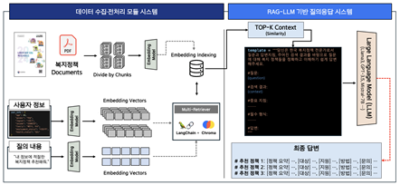

# RAG-LLM 기반 개인맞춤형 복지 서비스 추천 챗봇

  

---

## 서비스 개요

이 챗봇은 Streamlit 기반의 웹 인터페이스에서 동작하며, 사용자가 자연어로 복지 관련 질문을 입력하면 RAG-LLM(Retrieval-Augmented Generation Language Model) 기술을 활용하여 관련 복지 정책, 지원 제도, 신청 방법 등을 안내합니다.  
복잡한 조건 입력 없이 대화만으로 맞춤형 정보를 쉽고 빠르게 얻을 수 있습니다.

---

## 주요 기능

- **대화형 챗봇 UI**
  - Streamlit 기반 웹 UI 제공
  - 첫 화면 환영 메시지 및 사용 팁 안내
  - 채팅 입력창 하단 고정, 마이크(음성 입력) 버튼 지원
  - 여러 채팅방 생성/선택/삭제, 채팅 이력 관리
  - 연속 대화 및 이전 대화 이어받기 가능

- **복지 문서 임베딩 및 검색**
  - 기본 복지 정책 PDF 문서 자동 로드 및 임베딩(벡터화)
  - 사용자가 추가로 PDF 문서 업로드 가능
  - RAG 방식으로 관련 문서에서 정보를 검색하여 답변 생성

- **개인 맞춤형 답변 생성**
  - 질문 내 연령, 소득, 가족 구성 등 다양한 요소 반영
  - 복합 조건(예: 한부모+저소득 등)도 함께 고려
  - 답변에 참고자료, 출처, 신청 방법 등 실질적 정보 포함

- **실시간 스트리밍 답변**
  - 답변 생성 과정을 실시간으로 스트리밍하여 출력
  - 참고자료, 검색 결과, 출처를 함께 표시

- **상담 이력 및 피드백 관리**
  - 각 채팅별 대화 이력 저장 및 불러오기
  - 답변에 대한 피드백(좋아요/싫어요 및 의견) 기능 제공

- **접근성 및 편의성**
  - 고령층, 디지털 취약계층을 위한 큰 글씨, 직관적 UI
  - 반응형 웹 디자인, 음성 입력 지원

---

## 기술적 구조

- **Streamlit**: 웹 UI 및 세션 상태 관리
- **RAG-LLM**: 문서 기반 질의응답 및 답변 생성
- **PDF 문서 처리**: 복지 정책 PDF 임베딩 및 검색(Chroma, FAISS 등 벡터스토어 활용)
- **세션/채팅 관리**: 여러 채팅방, 대화 이력, 피드백 저장(세션 상태 기반)
- **보안 및 개인정보 보호**: 민감 정보 암호화 및 법규 준수

---

## 사용 예시

1. 사용자는 "30대 신혼부부를 위한 주거 지원 정책을 알려주세요"와 같이 질문을 입력합니다.
2. 챗봇은 관련 복지 문서를 검색하고, 맞춤형 정책, 신청 방법, 필요 서류, 담당 기관 등 핵심 정보를 요약하여 안내합니다.
3. 추가로 궁금한 점이 있으면 이어서 질문할 수 있으며, 이전 대화 이력이 자동으로 반영됩니다.
4. 답변에 대한 피드백(좋아요/싫어요 및 의견)을 남길 수 있습니다.

https://github.com/user-attachments/assets/0635d209-9e9a-4426-b992-1114104b6b84

---

## 개발 및 확장 참고사항

- **문서 추가/갱신**: PDF 업로드 기능을 통해 새로운 복지 정책 반영 가능
- **모듈화 구조**: 문서 임베딩, 검색, 답변 생성, UI 등 각 기능이 모듈화되어 유지보수 용이
- **확장성**: 다양한 복지 분야, 정책 변화, 사용자 요구에 유연하게 대응 가능

---
